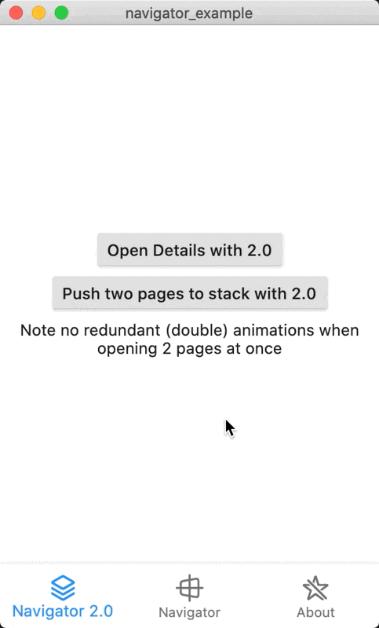
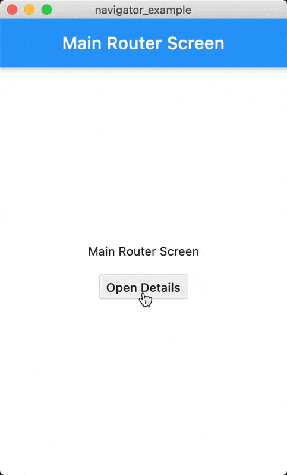
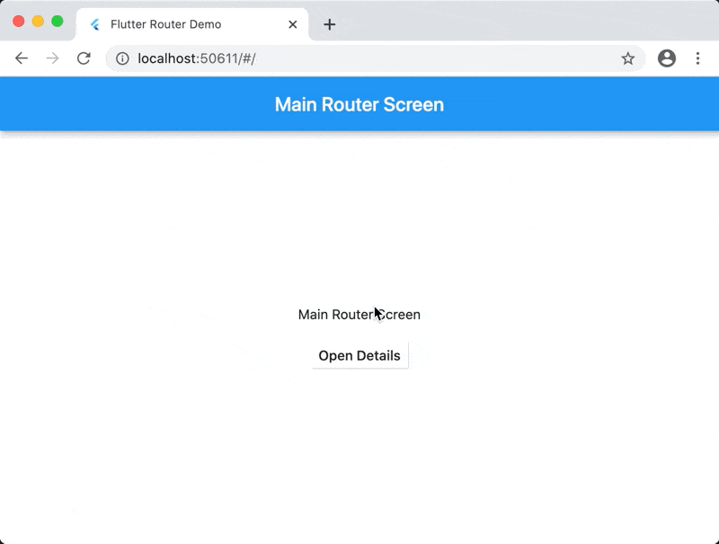

# Navigator 2.0 examples

[Web demo](https://navigator_20_example.codemagic.app/#/) of Router usage.

Navigator 2.0 Pages API example and Router example.

The main point of these examples is to show how to extract basic navigation logic to separate class (e.g. ChangeNotifier). I'm using 2 approaches:

- Pages API
- Router widget

Both of them use separate `PageManager` (or `RoutePageManager`) to handle navigation stack.

## Pages API

Navigator's Pages API is a convenient way to declaratively set navigation stack in your Flutter app. Take a look at the `main.dart` entry point and please notice custom `PageManager` class that is handling list of pages provided to `Navigator`.



## Router widget

For more complex and robust needs you may use the Router widget. Simple implementation can be found in `main_router.dart` entry point. Take a look at the custom `TheAppPath` class storing typed path information and `RoutePageManager` handling list of pages provided to the `Navigator`.



### Web address handling

Because the `RoutePageManager` is notifying the `Router` about its changes and the `currentPath` is used as `currentConfiguration` the address bar in the browser is reflecting the stack changes:

```dart
  @override
  TheAppPath get currentConfiguration => pageManager.currentPath;
```




# More

Run on Flutter dev (1.23)

[Presentation at Flutter Cracow (Sept. 17th, 2020)](https://docs.google.com/presentation/d/1d8bdw5OKnY0HmY2GqAHo17LJvRjdmy3FAxFb9DDd90o/edit?usp=sharing)

[Presentation at DevFest Poland 2020](https://bit.ly/3eU5EzG)

[Presentation at Geekle Cross-Platform Mobile Development Summit 2020](https://bit.ly/3ktFd5g)

Special thanks to [Simon Lightfoot](https://github.com/slightfoot/) and [Andrew Coutts](https://github.com/acoutts).

See more also in the [Stocks app example using Router](https://github.com/flutter/flutter/pull/63424).